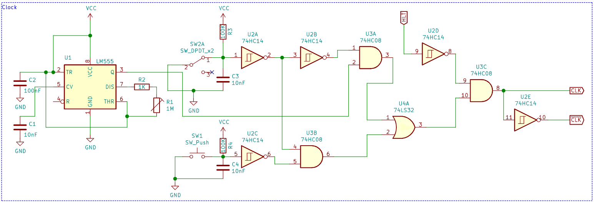
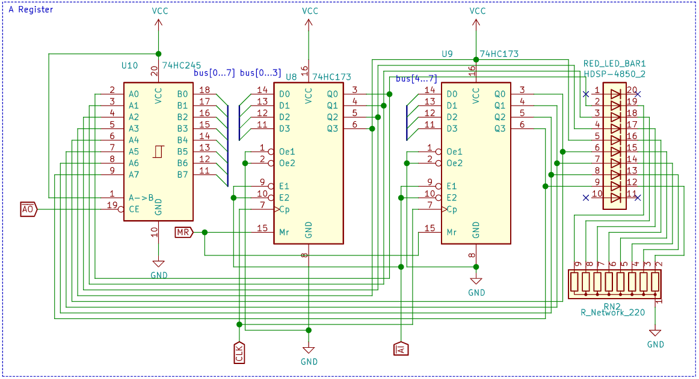
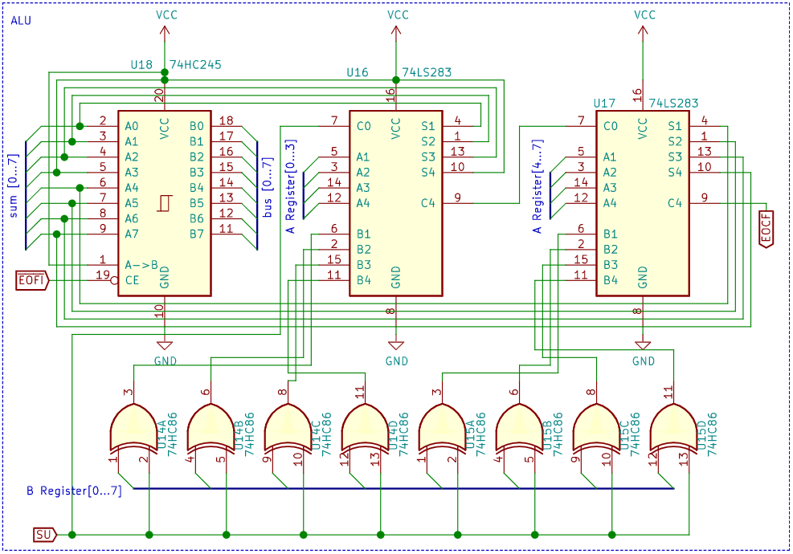
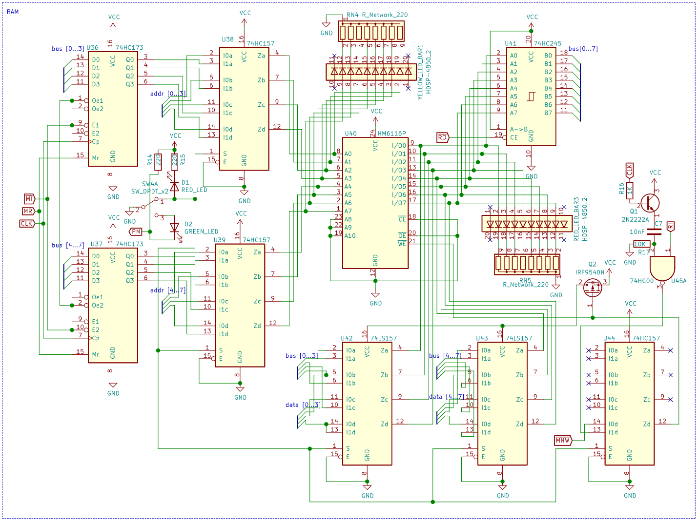

# MSAP-1 rev.B schematics

The hand-captured KiCad project for the machine on the bench - **the source of truth for the hardware**. `MSAP-1 rev. B.sch` is the schematic, `MSAP-1 rev. B.net` the netlist, `MSAP-1 rev. B.kicad_pcb` the board file, and `PNGs/` holds the plotted sheets shown below. (The simulator can also *generate* KiCad netlist/PCB/schematic files from its module registry - useful for modified designs - but for rev.B as built, these files are canonical.)

## Clock Module

The main oscillator is an LM555, speed controlled with the R1 potentiometer, with switches for bi-stable and mono-stable modes. The switches are debounced via a 100K-10nF RC into U2, an inverting Schmitt trigger - this gives better noise control at higher clock speeds, because synchronously coupled chips (like the cascaded binary counters) rely on clean, correctly timed edges. Failing to debounce the mono-stable switch (SW2) properly causes all sorts of unpredictable behavior.

## Program Counter

Two cascaded 4-bit presettable binary counters (74HC161) forming an 8-bit counter.

## General Purpose Registers (A and B)

Two 8-bit registers, each built from two 4-bit D flip-flops (74HC173).

## ALU

Two 4-bit full adders (74LS283) and two quad XORs (74HC86) that form the two's complement of the B operand, so the module adds and subtracts 8-bit numbers.

## RAM Module

Two 4-bit registers for the memory address, an HM6116P 2KB SRAM with non-inverting I/O, and multiplexing between bus and programmer input. Two discrete transistors: Q1 (NPN BJT) buffers the RC-generated RAM write pulse to minimize clock distortion; Q2 (P-channel MOSFET) disconnects power from the input multiplexers so they cannot sink current from the RAM I/O pins - 74LS/HC157 has no high-impedance mode. This trick requires U42/U43 to be Low-Power Schottky, not CMOS: CMOS parts would still be powered through their ESD protection diodes.

The program/run switch selects between the [CPU programmer](https://github.com/mehrantsi/8-bit_CPU_Programmer) interface and the bus, and the module produces the active-low MNW (Manual Write) and active-high PM (Program Mode) signals the programmer uses.

## Instructions Register

A 4-bit register for the opcode and an 8-bit register for the operand. Every II pulse toggles between them (a 4-bit presettable counter plus a demultiplexer that holds the IE pins high in between), and the opcode register output is enabled only after a fetch cycle completes, until the next asynchronous RST - a JK flip-flop latch that lets the microcode reuse the fetch flow. The active-low T0 input from the control logic's step decoder resets the toggle counter at step 0.

## Control Logic

The micro-instruction step counter (4-bit counter + 3-to-8 demultiplexer) addresses two 2Kx8 AT28C16 EEPROMs holding the [microcode](https://github.com/mehrantsi/8-bit_CPU_uCodes), with two quad inverters generating the active-low signals - the EEPROM outputs stay active-high regardless of the control signal polarity.

## Output Display and Register

An 8-bit output register, a 555 timer with a dual JK flip-flop and decoder multiplexing four 7-segment displays, and an AT28C16 holding the [binary to 7-segment decode](https://github.com/mehrantsi/Mux7-Segment). SW3 switches between signed and unsigned presentation.

## Flags Register

A 4-bit D flip-flop keeps the carry (CF) and zero (ZF) flags, with zero-detect circuitry on the ALU sum. The register outputs drive address lines of the control EEPROMs, so the microcode executed for JC and JZ changes with the flags.

## Reset Circuit

Generates the active-low and active-high reset signals for the flip-flops and counters, plus the active-low RSTSTP signal that resets the step counter and the opcode-latching JK flip-flop.

